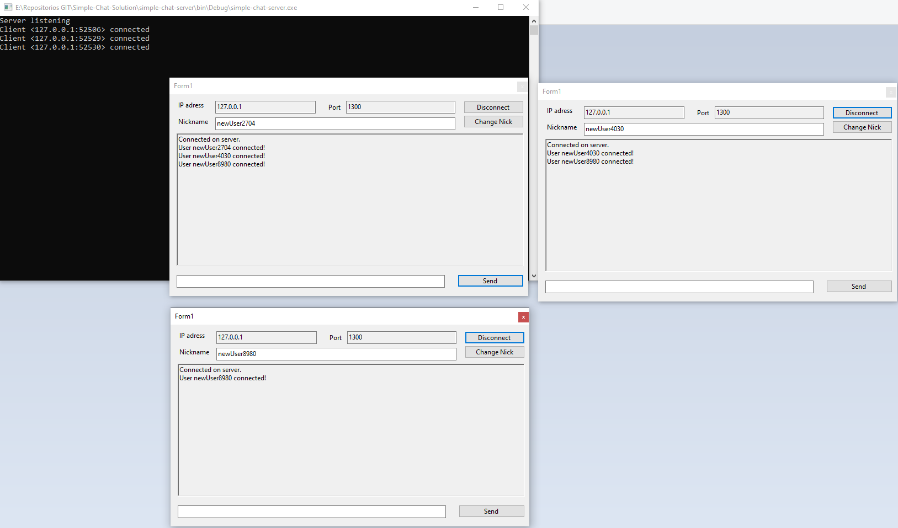

# Simple-Chat-Solution

Este projeto tem como objetivo implementar um chat simples, onde um servidor (Console App) pode receber conexões locais de multiplos clientes.

Alguns comandos foram implementados.

Para executar os comandos, basta digitar no local específicado para chat e clicar em Send ou apertar Enter.

/exit -> fecha a janela do ClientChat.
/logout -> desloga do Servidor.
/changeNick {NovoNick} -> altera o nick do usuario.
/join {nomeDaSala} -> o usuario entrará em uma sala, saindo da anterior.
/w {NickDoDestinatario} {mensagem} -> O usuario envia uma mensagem para outro usuario, independente deste estar na mesma sala ou não.
/help -> O usuario recebe ajuda do servidor.

# Algumas imagens do sistema.

